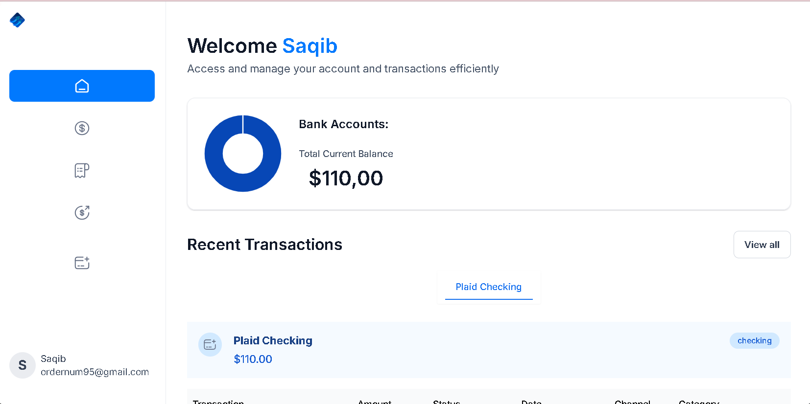
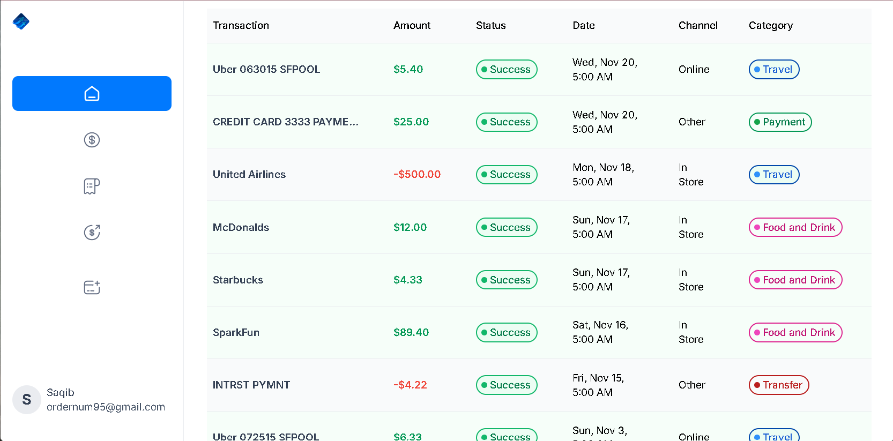
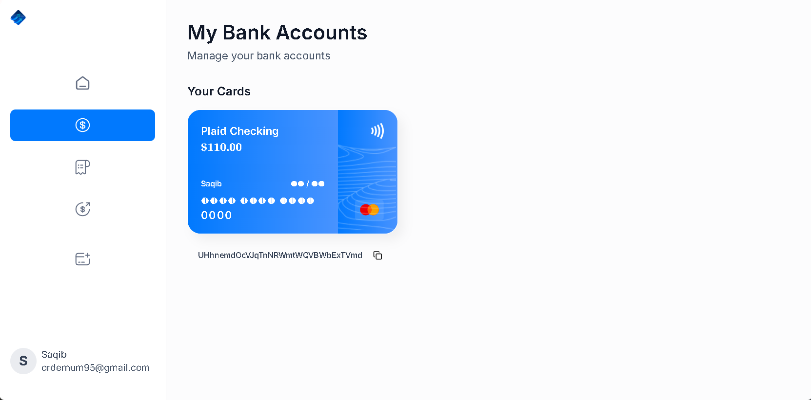

##


# Introduction
Built with Next.js, Silk is a financial SaaS platform that connects to multiple bank accounts, displays transactions in real-time, allows users to transfer money to other platform users, and manages their finances altogether.


# Tech Stack
* Next.js
* TypeScript
* Appwrite
* Plaid
* Dwolla
* React Hook Form
* Zod
* TailwindCSS
* Chart.js
* ShadCN

# Features
👉 **Authentication**: An ultra-secure SSR authentication with proper validations and authorization

👉 **Connect Banks**: Integrates with Plaid for multiple bank account linking

👉 **Home Page**: Shows general overview of user account with total balance from all connected banks, recent transactions, money spent on different categories, etc

👉 **My Banks**: Check the complete list of all connected banks with respective balances, account details

👉 **Transaction History**: Includes pagination and filtering options for viewing transaction history of different banks

👉 **Real-time Updates**: Reflects changes across all relevant pages upon connecting new bank accounts.

👉 **Funds Transfer**: Allows users to transfer funds using Dwolla to other accounts with required fields and recipient bank ID.

👉 **Responsiveness**: Ensures the application adapts seamlessly to various screen sizes and devices, providing a consistent user experience across desktop, tablet, and mobile platforms.

and many more, including code architecture and reusability.

# Quick Start
Follow these steps to set up the project locally on your machine.

## Prerequisites

Make sure you have the following installed on your machine:

[Git](https://git-scm.com/) <br />
[Node.js](https://nodejs.org/en) <br />
[npm](https://www.npmjs.com/) (Node Package Manager)

## Cloning the Repository
```bash
git clone https://github.com/fahad7169/banking.git 
cd banking

```
## Installation

Install the project dependencies using npm:

```bash
npm install

```
## Set Up Environment Variables

Create a new file named .env in the root of your project and add the following content:

```bash
#NEXT
NEXT_PUBLIC_SITE_URL=

#APPWRITE
NEXT_PUBLIC_APPWRITE_ENDPOINT=https://cloud.appwrite.io/v1
NEXT_PUBLIC_APPWRITE_PROJECT=
APPWRITE_DATABASE_ID=
APPWRITE_USER_COLLECTION_ID=
APPWRITE_BANK_COLLECTION_ID=
APPWRITE_TRANSACTION_COLLECTION_ID=
APPWRITE_SECRET=

#PLAID
PLAID_CLIENT_ID=
PLAID_SECRET=
PLAID_ENV=
PLAID_PRODUCTS=
PLAID_COUNTRY_CODES=

#DWOLLA
DWOLLA_KEY=
DWOLLA_SECRET=
DWOLLA_BASE_URL=https://api-sandbox.dwolla.com
DWOLLA_ENV=sandbox


```


Running the Project


```bash
npm run dev

```
Open http://localhost:3000 in your browser to view the project.

